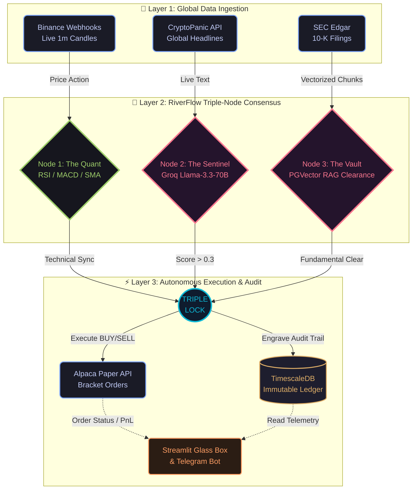

<div align="center">

# 🌊 RiverFlow Apex 4.0
**Autonomous Triple-Node AI Hedge Fund Architecture**

[](#)
[](#)
[](#)
[](#)
[](#)

*Fusing Event-Driven Microservices, Real-Time Market Math, and Institutional Retrieval-Augmented Generation (RAG) for absolute alpha generation.*

</div>

---

## 💠 The Autonomous Intelligence Engine
> *"RiverFlow prioritizes the cryptographic reliability of an immutable ledger over the theoretical speed of an unverified execution."*

**RiverFlow Apex 4.0** is an institutional-grade, distributed algorithmic trading suite. It completely eliminates "black box" trading by fusing high-frequency technical analysis with advanced Large Language Model (LLM) sentiment synthesis and real-time SEC filing verification. Engineered for deployment on the Alpaca exchange, it operates on a strict, zero-trust **Triple-Node Architecture**.


### 🚀 Core Architecture
* 🧠 **Neural RAG Engine**: Leverages `Llama-3.3-70B` via **Groq LPUs** to slice, vectorize, and reason over dense 150-page SEC 10-K filings in milliseconds.
* 📈 **Quantitative Suite**: High-speed, Pandas-driven vectorized calculation of **RSI, MACD, and 200-SMA** for multi-factor signal confluence.
* 🛡️ **Immutable Audit Vault**: Every execution, technical parameter, and AI reasoning log is permanently engraved into a **TimescaleDB** instance to ensure total regulatory compliance and explainability.
* ⚡ **Global Sentiment Sync**: Live NLP aggregation of global macroeconomic news via the **CryptoPanic API**.
* 📱 **Mobile Command & Control**: Real-time Streamlit Dashboard visualization and push-based auditing via the **Telegram Bot API**.

---

## 📊 The Triple-Lock Consensus Protocol
A trade is only authorized when three fully independent, isolated microservices reach consensus. If a single node dissents, the execution is terminated.

1. **The Quant Node (Math)**: RSI indicates a severe oversold dip (`< 50`) while maintaining macro support (`Price > 200-SMA`). Momentum is confirmed via MACD crossover.
2. **The Sentinel Node (Sentiment)**: Groq AI parses live global headlines, isolating noise from systemic shocks, requiring a confidence score of `> +0.3`.
3. **The Institutional Node (Fundamental)**: The system queries a specialized PGVector database containing vectorized SEC corporate filings. The AI must explicitly return `CLEAR` regarding corporate debt and liquidation risks.

---

## 🛠️ The Microservice Stack
To guarantee high availability and prevent resource starvation, heavy Machine Learning processing is strictly isolated from the ultra-fast trading execution engine.

| Microservice | Designation | Technology | Description |
| :--- | :--- | :--- | :--- |
| `sentient_writer` | **The Execution Bot** |  | A stripped-down, lightning-fast loop that monitors Binance webhooks, calculates indicators, and fires Alpaca API orders. |
| `sentient_analyst` | **The NLP Heavy Engine** |  | Houses massive HuggingFace sentence-transformers and BeautifulSoup web-scrapers to digest and vectorize SEC 10-K filings. |
| `sentient_db` | **The Immutable Ledger** |  | Central nervous system. Stores vector embeddings for the RAG brain and immutable logs of all executed trades. |
| `sentient_dashboard`| **The Glass Box UI** |  | Real-time command center for monitoring the RAG brain, auditing trade history, and triggering emergency liquidations. |

---

## 🗄️ The SEC RAG Pipeline (Phase C)
General "internet knowledge" is lethal in quantitative finance. RiverFlow Apex utilizes a custom Retrieval-Augmented Generation pipeline to ground its AI strictly in verified corporate reality.


1. **Target Acquisition**: Bypasses basic firewall protections to scrape live Edgar SEC filings.
2. **The Slicer**: `RecursiveCharacterTextSplitter` breaks 100+ page documents into strategic overlapping chunks.
3. **Neural Translation**: `all-MiniLM-L6-v2` converts English text into dense mathematical arrays.
4. **The Vault Drop**: Injects the arrays into `langchain_pg_embedding` for instant semantic similarity search prior to trade execution.

---

## 🚦 Deployment & Ignition Sequence
*Disclaimer: Architecture built for advanced research and simulation. Automated trading involves significant risk of loss.*

### 1. Secure Environment Initialization
Create a `.env` file in the root directory. **(Never commit this file to version control).**
```bash
# Exchange & Intelligence Keys
ALPACA_KEY=your_alpaca_key
ALPACA_SECRET=your_alpaca_secret
GROQ_API_KEY=your_groq_key
CRYPTOPANIC_KEY=your_cryptopanic_key

# Infrastructure Security
DB_PASSWORD=highly_secure_vault_password
TELEGRAM_TOKEN=your_bot_token
TELEGRAM_CHAT_ID=your_chat_id
```
### 2. Ignite the Distributed Architecture
```Bash
# 1. Boot the entire multi-container infrastructure
docker-compose up -d --build

# 2. Arm the Fundamental Vault (Scrape and Vectorize SEC 10-K)
docker exec -it sentient_analyst python sec_ingestor.py

# 3. Verify systems are running and actively hunting
docker logs -f sentient_writer
```
### 3. Access Command & Control
Navigate to *http://localhost:8501* to access the Streamlit Dashboard. From here, you can query the RAG SEC Vault and monitor the Immutable Audit Ledger in real-time.

---



---

### 4. 🗺️ Strategic Roadmap: Mission Accomplished
* **Phase A: The Quantitative Engine ✅**

    [x] Integrate live Binance data streams and calculate multi-factor math locks.

    [x] Connect Alpaca Trade API with dynamic ATR stop-loss algorithms.

 * **Phase B: The Glass Box & Audit Ledger ✅**

    [x] Deploy TimescaleDB for time-series optimized execution logging.

    [x] Build Streamlit UI with Emergency Liquidation overrides.

    [x] Establish Telegram push-notification telemetry.

 * **Phase C: The Institutional RAG Brain ✅**

    [x] Deploy isolated edgar_processor microservice for heavy NLP.

    [x] Construct BeautifulSoup pipeline to autonomously scrape SEC filings.

    [x] Integrate PGVector and LangChain for semantic database querying.

    [x] Establish the final Triple-Node consensus lock.

<div align="center">
<i><b>Engineered for Alpha. Built for Resilience.</b></i>
</div>
